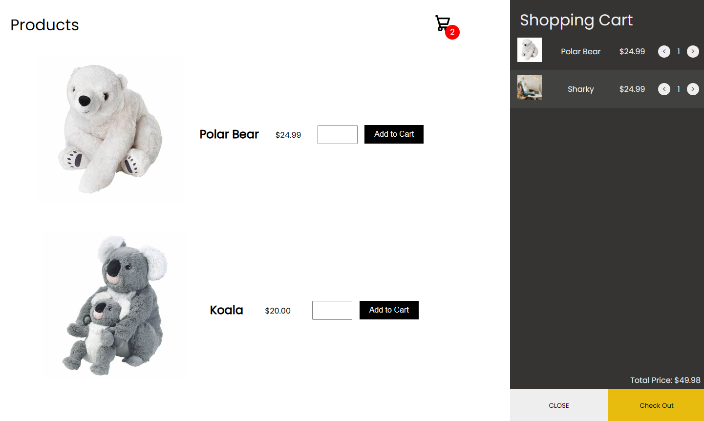
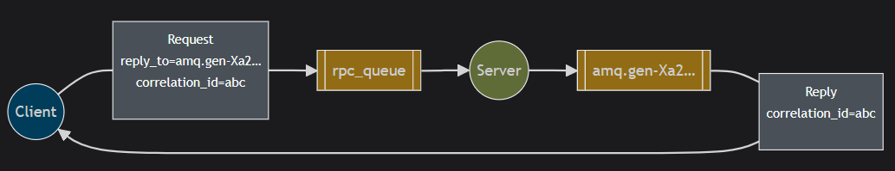
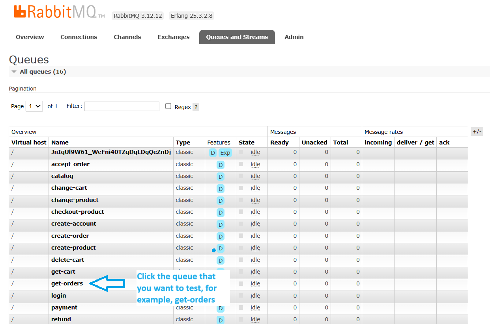
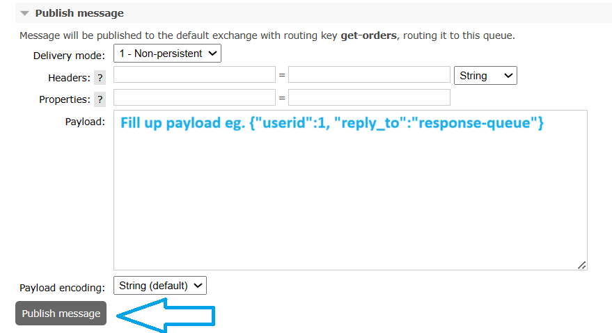
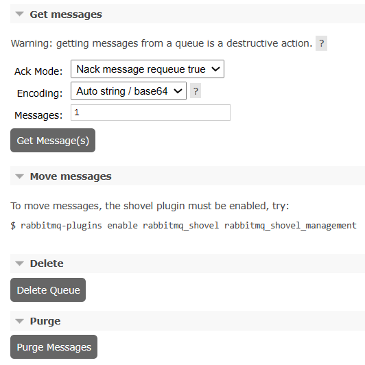

# MicroMall :department_store:
## About project
MicroMall is an e-commerce web application utilizing microservice architecture and asynchronous communication with RabbitMQ.


## Technologies used :mag_right:
- Node.js
- Express.js
- RabbitMQ :envelope:
- Docker :whale:
- Stripe :credit_card:
- MongoDB and MongoDB Compass

### Monitoring Technologies :chart_with_upwards_trend:
| Tool | Description |
| --- | --- |
| cAdvisor | A daemon that collects, aggregates, processes, and exports information about running containers |
| Prometheus | Collects metrics via HTTP pull. Stores scraped metrics as time series data and uses PromQL to query metrics |
| Promtail | Attaches labels to log streams and pushes logs to Loki |
| Grafana Loki | Collects logs via HTTP push. Designed with scalabiility in mind, it only indexes metadata of logs (labels) and compresses logs into chunks to store them. Uses LogQL to query logs |
| Grafana | Dashboarding tool to visualise logs and metrics |

## Architecture diagram


This diagram is colour coded (each service has a different colour). The service and the queues that are related to its functionalities e.g. cart-service and change-cart queue, are the same colour. The arrows represent messages being published to queues and the circles mean consuming from. For example, the frontend service sends a message to the login queue, which the auth service consumes from and then sends a reply message to the response queue of the frontend service which it consumes from.\
Note: The RabbitMQ port shown in the diagram is 15672 for the GUI, since this project uses the RabbitMQ management tag image which has rabbitmq management plugin installed and enabled by default. It also exposes two more ports 5672 for AMQP communication and 15692 for its metrics because of the rabbitmq-prometheus plugin being enabled. \
Other ports that are exposed in my project is port 9323 for docker daemon metrics. See [Configurations Needed](https://github.com/Joulenergy/MicroMall/tree/main?tab=readme-ov-file#configurations-needed) for configuring the docker daemon to release metrics.

## Explaining the RabbitMQ code used
The backend services, cart, auth, product and order consume from various queues for seperate functions. For example, the product service consumes from the change-product queue for messages that require updating product stocks and the catalog queue that tell it what product information it needs to read from the database, and send a reply to the frontend response queue. These services reuse the useRabbit.js and rabbitmq.js code that is in the rabbitmq folder:
- The useRabbit.js file contains two functions - consume() and sendItem() - for consuming messages and sending a reply to the frontend. The consume function has a parameter for defining a fanout exchange and binding the queue with the exchange. The function can be improved to be used for different kinds of exchanges, but for this project only the fanout and default rabbitmq exchanges are used. Most of the services use the default exchange, where the frontend send the message with the same routing and binding key as the queue name. See https://www.rabbitmq.com/tutorials/amqp-concepts for more information on rabbitmq exchanges and other concepts.
- The rabbitmq.js file contains the function connect() that returns a promise that resolves with the rabbitmq connection. The connection is retried since on docker-compose up, rabbitmq takes some time to set up. The environment variables I set in the docker-compose file for each service, RABBITMQ_USERNAME and RABBITMQ_PASSWORD, is used here when connecting. Having seperate accounts allows for easier monitoring of channels and connections in the rabbitmq GUI. Permissions for each user can also be configured, for example my product service user does not have the permission to access the rabbitmq GUI, and can only access the virtual host '/'. For more information see the section [Configuring RabbitMQ](https://github.com/Joulenergy/MicroMall/tree/main?tab=readme-ov-file#configuring-rabbitmq)

The frontend service and payment service use different rabbitmq files from the backend services, as they require responses from other services.
- The frontend and payment services share a separate rabbitmq.js file, response-rabbitmq.js in the rabbitmq folder. This is allows them to create a response channel and send channel when connected to rabbitmq, compared to the backend services that use multiple channels depending on the number of queues they are connected to with their consume() function.
- The payment service and frontend service also have different useRabbit files.\
The frontend service sendItem() function sends messages to the backend services following the RabbitMQ RPC Pattern (see image below), generating unique correlation IDs for it to receive responses by incrementing a counter. \
On the other hand, the payment service does not send a correlation ID but uses the userId of the response of the cart service to find its corresponding message.\
Rather than the consume() function, the frontend and payment service have a getResponse() function that waits for a response with a timeout of 30 seconds and error handling for no response being received. \
Each frontend session has a seperate response queue, with the sessionID as the name. The correlation IDs of incoming messages are checked to ensure that the message received by the frontend from the response queue is the intended one and allows for rejecting of message replies to messages that the frontend is no longer waiting for due to the timeout. (Note: this may be inefficient for a large number of users so it may be possible to combine it into one response queue and nack and requeue messages that are not corresponding to the sessionID or correlationID)\
On the other hand, the payment service getResponse() function uses one 'payment' queue for replies and requeues messages with different userId from the user initiating the checkout session until it finds the corresponding cart.



This is a useful youtube playlist for learning RabbitMQ that covers many parts of the documentation in video format: [RabbitMQ Tutorial Playlist](https://youtube.com/playlist?list=PLalrWAGybpB-UHbRDhFsBgXJM1g6T4IvO&si=CynlhZlARrUxKFkm)

## How to use the application
### Running Dockerized :whale:
```
# clone repository
git clone https://github.com/Joulenergy/MicroMall.git

# access the main directory
cd MicroMall

# create nodetini image
docker build . -t nodetini
```
Tini is used to perform signal forwarding for proper cleanup of my containers on docker-compose down or ctrl C, forwarding the SIGTERM signal and allowing my containers to close connections to RabbitMQ, MongoDB and close my express HTTP servers gracefully. This is needed since docker only sends the SIGTERM to PID1, which does not send the signal to my node applications which use npm start -> nodemon -> node. The cleanup code can be found in cleanup.js

### Configurations Needed
- Set up a stripe account - the test api key can be used for free
- Create .env file with stripe private key in Micromall directory
```
STRIPE_PRIVATE_KEY=<key>
```
- Edit the docker-compose.yml file with the correct bind mount path to the docker daemon logs depending on the operating system, for example /var/logs for linux, or %LOCALAPPDATA%\Docker\log\vm for windows WSL2. Refer to: https://docs.docker.com/config/daemon/logs/
- Change the docker daemon.json file. It can be found in different locations by defualt, for example, Docker Desktop settings. Refer to: https://docs.docker.com/config/daemon/prometheus/. After changing the configuration file, you may need to restart the docker engine for it to apply. Note: the available metrics and their names are in active development and may change at any time\
My daemon file after editing it:
```
{
  "builder": {
    "gc": {
      "defaultKeepStorage": "20GB",
      "enabled": true
    }
  },
  "experimental": true,
  "metrics-addr": "127.0.0.1:9323"
}
```

Finally,
```
# build the images and run the containers:
docker-compose up

# stop and delete all running containers:
docker-compose down
```
Navigate to these pages on your browser:
```
# For Frontend
http://localhost:3000 
# login with admin@gmail.com and password admin, the default admin I have configured (edit mongodb with mongodbCompass to change admin details - auth-mongo runs on port 5001)

# For RabbitMQ GUI
http://localhost:15672
# login with admin admin, the default user I have configured (or whatever password you configure)

# For Grafana
http://localhost:3001
# login with admin admin, the default user I have configured (or whatever password you configure)

# For cAdvisor
http://localhost:8080
# to see all running continers
http://localhost:8080/docker 

# For Prometheus
http://localhost:9090
# to check scraping targets for metrics
http://localhost:9090/targets

# For Loki
http://localhost:3100/metrics 
# metrics being exposed means it is up

# For Promtail
http://localhost:9080/targets 
# to check scraping targets for logs
```
Go to the /metrics route to see the metrics being exposed. In prometheus /targets route, the service names or IP addresses are used in the links Eg. http://rabbitmq:15692/metrics where docker will replace 'rabbitmq' with the IP address of the container in the network. To view the metrics, simply replace the service name or IP address with localhost as the docker-compose file exposes the metrics ports. http://localhost:15692/metrics for RabbitMQ (Note: if not interested in seeing the RabbitMQ metrics on localhost, edit the docker compose file to remove the port 15692 for rabbitmq and uncomment the expose 15692 code)

### Testing the app with the frontend
1. Using the admin account, head to http://localhost/3000/createproduct route to create a product. Return to the catalog page. The product should appear
2. Add it to cart. The cart icon at the top right of the screen should update the number of items in the cart. \
Note: alerts are given when:
- More items than stock is attempted to be added to cart
- Product stock is updated, leading to the cart being updated
3. Pressing the cart icon at the top right corner will open the cart. Press the 'Check Out' button at the bottom right of the cart, which will check available stocks with the product service and display the products available for purchase, and the total price.
4. Press the 'Pay Now' button to be redirected to the stripe page.

#### Testing the stripe integration
Example Test Cards with any CVV and expiry:
|NUMBER|DESCRIPTION|
|---|---|
|4242424242424242|  Succeeds and immediately processes the payment.|
|4000000000003220|  Requires 3D Secure 2 authentication for a successful payment.|
|4000000000009995|  Always fails with a decline code of insufficient_funds.|

[Stripe Integration Testing with Test Cards](https://docs.stripe.com/testing)

5. Since there is only one shipping option configured for this stripe checkout, it should show $5.00 shipping fee added to the total cost. If the back button on the page is clicked, the session will be closed and the user is redirected back to http://localhost:3000/cancel page.
6. If payment is completed, the user will be redirected to http://localhost:3000/success, with the OrderId. If there was an error creating an order or time lag in the asynchronous creation of the order, the OrderId may not show, only showing "Thank you for your order!"

### Testing the app with the RabbitMQ GUI
There are some functionalities such as the refund and get-orders queue which do not currently have a frontend component made to test them. They can be tested through the RabbitMQ management GUI. 


-
Under the publish message section, send a message to the queue


- 
Other queue actions include getting messages (reject, ack and requeue possible), moving messages and deleting the queue, or purging the queue (deleting all messages in the queue)



## Other Possible Configurations
- Change the default passwords of rabbitmq (in dockerfile currently) and grafana (in docker-compose file currently) and put them in a secure location :closed_lock_with_key: e.g. not committed .env files
- Change the session secret in frontend.env
- Add additional metric or log scraping jobs to prometheus.yml/ promtail.yml files
- Add additional datasources configurations into datasources.yml file in grafana folder
- Deploying multiple of the same container:
```
# example
services:
  myapp:
    image: awesome/webapp
    deploy:
      mode: replicated
      replicas: 6
```
- The bind mounts of the respective service folders eg. ./frontend-service:/app and /app/node_modules and the npm start with nodemon in the package.json files are for the hot reloading of the services and the ignoring of the local node_modules folder created with npm init (used for for intellisense). These should be removed for production. Note: the bind mount may create empty files for rabbitmq.js and cleanup.js in the folder on docker-compose up.

### Configuring RabbitMQ
This project uses the default vhost '/' (virtual host) and has created its own seperate accounts for each microservice which allows for easier monitoring of channels and connections on the rabbitmq gui.\
To create vhosts and accounts - other than the default account which username and password can be configured with environment variables like in my rabbitmq folder dockerfile - create your own definitions.json file. \
Either hash passwords and configure vhost manually by writing your own definitions.json file, or create and export them through the GUI to mount into the container. \
Edit the vhost and passwords into rabbitmq.js file in each container to use when connecting to rabbitmq and put passwords somewhere secure :closed_lock_with_key: - e.g. in a not committed .env file.
It is also possible to define the queues and exchanges needed in the configuration file such that they are set up on container build rather than creating them in the code for queues and exchanges that are always used.

#### Picture Guide to creating accounts and exporting definitions.json file
Note: It would be good to create a new container with the rabbitmq:management image and use it to export the definitions as my container has my own project's accounts configured. Make sure to use a consistent version of rabbitmq as there are many management images available. Refer to: https://hub.docker.com/_/rabbitmq


 -

 -

 -


### Configuring the Monitoring Technologies
#### Prometheus
The prometheus in this project uses the prometheus.yml file to configure scraping of targets. The file is loaded with the --config.file flag. \
The retention time for the local storage can be configured in the docker-compose file command --storage.tsdb.retention.time. For other storage configurations, refer to https://prometheus.io/docs/prometheus/latest/storage/#operational-aspects.

For writing the configuration file, refer to: https://prometheus.io/docs/prometheus/latest/configuration/configuration/. This project uses scrape_configs, relabel_configs, static_configs and docker_sd_configs to specify and modify the labels of scraped targets. Other configurations like dockerswarm_sd_config or kubernetes_sd_config can be used to dynamically discover services for other use cases. Note even though the headings for the sections do not have the ending 's', the 's' is needed in the yaml file.

docker_sd_configs allows for the dynamic discovery of metric endpoints of docker containers running in the docker daemon. In this project, user: root permission in the docker-compose.yaml file is given to prometheus since it would give an error of not having permission when using the docker socket for service discovery. If this poses security concerns, there are other solutions such as using a [docker socat proxy](https://github.com/prometheus/prometheus/discussions/9640). It is also possible to manually configure the endpoints to scrape from with static configurations:
```
- job_name: prometheus
  metrics_path: /metrics # /metrics is the default, change if needed
  static_configs: 
    - targets: 
      - prometheus:9090 

- job_name: cadvisor
  static_configs:
  - targets:
    - cadvisor:8080

- job_name: loki
  static_configs:
  - targets:
    - loki:3100

- job_name: promtail
  static_configs:
  - targets:
    - promtail:9080

- job_name: grafana
  static_configs:
  - targets:
    - grafana:3001

```
static_config is used for rabbitmq since docker_sd_config will create a target for every port your containers are configured to expose, and rabbitmq is configured to expose many ports, resulting in prometheus attempting to scrape from the other ports and causing error messages from rabbitmq. static config can also be useful when the endpoint needs to always be up and does not require dynamic service discovery, as it will show that the endpoint is down when the container is deleted with information like its last scrape.
Alternatively, the relabel_config can be used to drop targets which target the ports which do not need to be scraped together (allowing for the dynamic service discovery to be used instead of static configuration).\
Note that 'filters' is used in the configuration file but it can only filter which containers that are scraped and cannot limit the ports that are scraped from so relabel_configs is preferred for more complex filtering. Refer to https://docs.docker.com/engine/api/v1.40/#tag/Container/operation/ContainerList for the list of filters that can be used. Only containers that match the filter condition eg. name = /loki will be scraped from. If unsure of the values of some of the filters, checking the prometheus target list at http://localhost:9080/targets, there is a labels column which can be expanded to show discovered labels and their values. 
Example with relabel config:
```
- job_name: dockersdconfig
  docker_sd_configs: 
    - host: unix:///var/run/docker.sock
      refresh_interval: 30s  
      
  relabel_configs:
    - source_labels: ['__meta_docker_container_name']
      regex: '.*-mongo|.*-service'
      action: drop

    - source_labels: ['__meta_docker_container_name', '__meta_docker_port_public']
      regex: '/rabbitmq;15692|/[^r]{1}.*;\d*' 
      action: keep
      # keeps only rabbitmq with a specific port and any service that does not start with 'r' and any port
      # done this way since there is no negative lookahead with RE2 that is used for prometheus

    - source_labels: ['__meta_docker_container_name']
      regex: '/(.*)' # removes leading / from container name
      target_label: 'job'
```
As the documentation can be quite confused, I used https://training.promlabs.com/trainings which has some free training with example code that is useful to reference!

#### Promtail
Promtail in this project uses the promtail.yml file to configure scraping containers and the docker daemon for logs and for relabelling the logs. The file is loaded with the -config.file flag (note only one '-'). Refer to https://grafana.com/docs/loki/v2.8.x/clients/promtail/configuration/ for how to write the config yaml file for various log sources.

Promtail pipeline stages can be used to process the log lines and extract metrics and lables. There are four types of stages, parsing, transform, action and filtering. More information can be found here: https://grafana.com/docs/loki/v2.8.x/clients/promtail/pipelines/ and a summary of all the stages can be found here: https://grafana.com/docs/loki/v2.8.x/clients/promtail/stages/

Note: my project uses the latest tag for the docker images of loki and promtail but it is not the latest version of Grafana Loki - the latest version is v-3.0.x, but the documentation I have linked is for v-2.8.x. However since the official docker images may be updated, the version info can be checked in my grafana dashboard that monitors loki and promtail or by searching promtail_build_info or loki_build_info in prometheus.