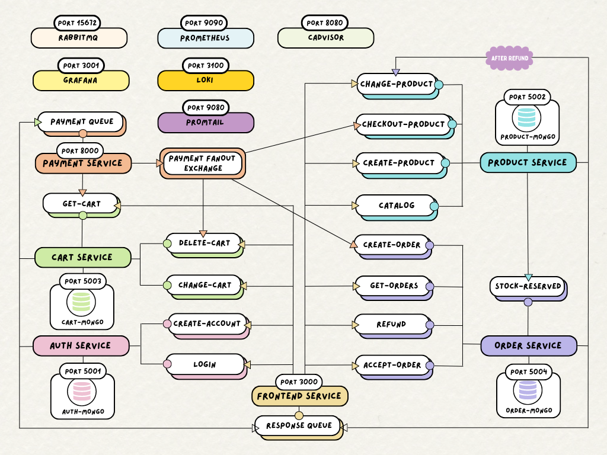

# MicroMall :department_store:
## About project
MicroMall is an e-commerce web application utilizing microservice architecture and asynchronous communication with RabbitMQ.

### Architecture diagram



## How to use the application
### Running Dockerized :whale:
```
# clone repository
git clone https://github.com/Joulenergy/MicroMall.git

# access the main directory
cd MicroMall
```

#### Configurations Needed:
- Set up a stripe account
- Create env files with stripe private keys

#### Other Possible Configurations:
- Change the default passwords of rabbitmq (in dockerfile currently) and grafana (in docker-compose file currently) and put them in a secure location :closed_lock_with_key: e.g. not committed .env files
- Add additional metric scraping jobs to prometheus.yml file
- Add additional datasources configurations into datasources.yml file in grafana folder

Finally,
```
# build the images and run the containers
docker-compose up
```
Navigate to these pages on your browser:
```
# For Frontend
http://localhost:3000 
# login with admin@gmail.com and password admin, the default admin I have configured (edit mongodb with mongodbCompass to change admin details - auth-mongo runs on port 5001)

# For RabbitMQ GUI
http://localhost:15672
# login with admin admin, the default user I have configured (or whatever password you configure)

# For Grafana
http://localhost:3001
# login with admin admin, the default user I have configured (or whatever password you configure)

# For cAdvisor
http://localhost:8080
# to see all running continers
http://localhost:8080/docker 

# For Prometheus
http://localhost:9090
# to check scraping targets and metrics endpoints
http://localhost:9090/targets
```

#### Testing the stripe integration:
Example Test Cards with any CVV and expiry:
|NUMBER	|DESCRIPTION|
|---|---|
|4242424242424242|  Succeeds and immediately processes the payment.|
|4000000000003220|  Requires 3D Secure 2 authentication for a successful payment.|
|4000000000009995|  Always fails with a decline code of insufficient_funds.|

[Stripe Integration Testing with Test Cards](https://docs.stripe.com/testing)

### Configuring RabbitMQ
This project uses the default vhost '/' and has created its own seperate accounts for each microservice which allows for easier monitoring of channels and connections on the rabbitmq gui.\
To create vhost and accounts other than the default account which username and password can be configured with environment variables like in my rabbitmq folder dockerfile, create your own definitions.json file. \
Either hash passwords and configure vhost manually and add in definitions.json file, or create them through the GUI and export the definitions.json file to mount into the container. \
Edit the vhost and passwords into rabbitmq.js file in each container to use when connecting to rabbitmq and put passwords somewhere secure :closed_lock_with_key: - e.g. in a not committed .env file.

#### Picture Guide to creating accounts
Note: It would be good to create a new container with the rabbitmq:management image/other rabbitmq images and use it to export the definitions as my container has my own project's accounts configured


## Technologies used :mag_right:
- Node.js
- Express.js
- RabbitMQ :envelope:
- Docker :whale:
- Stripe :credit_card:
- MongoDB and MongoDB Compass

### Monitoring Technologies :chart_with_upwards_trend:
- cAdvisor
- Prometheus
- Grafana